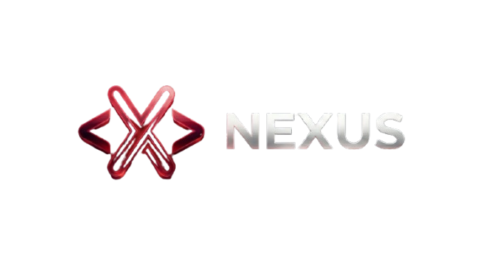

  

[English](README.md) | [العربية](README_AR.md)

---

# Nexus: The Autonomous AI Agent

**Nexus is a powerful, autonomous AI agent designed to bridge the gap between complex data and actionable insights.**

The agent utilizes state-of-the-art LLMs to autonomously plan, execute, and analyze complex tasks. Inspired by the need for interconnected systems, Nexus provides a unified interface to manage workflows, analyze data streams, and generate comprehensive reports without constant human intervention.

Our mission is to empower developers and enterprises with a scalable, intelligent "brain" that can adapt to any environment.

##  Why Nexus?

- **🚀 Autonomous Operation:** Give it a goal, and Nexus figures out the steps.
- **🔗 Seamless Integration:** Connects easily with Docker, APIs, and Databases.
- **🧠 Context Awareness:** Remembers past interactions to provide smarter results.
- **🛡️ Secure & Private:** Built with privacy-first architecture.فق